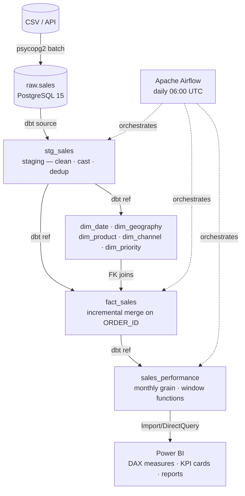

# Architecture — Modern Data Platform

## Overview

A production-grade, end-to-end data platform built on open-source components. The platform ingests raw sales data, transforms it through a star schema using dbt, orchestrates daily runs via Apache Airflow, and exposes a semantic layer to Power BI.

## Architecture Diagram

```
┌─────────────────────────────────────────────────────────────────────────┐
│                        SOURCE LAYER                                     │
│  CSV / API / ERP Export  →  ingestion/load_sales.py                    │
└─────────────────────────────┬───────────────────────────────────────────┘
                              │  psycopg2 + batch execute_values
                              ▼
┌─────────────────────────────────────────────────────────────────────────┐
│                        RAW LAYER  (PostgreSQL)                          │
│  Schema: raw                                                            │
│  Table:  raw.sales  (14 columns, append-only, _ingested_at timestamp)  │
└─────────────────────────────┬───────────────────────────────────────────┘
                              │  dbt source()
                              ▼
┌─────────────────────────────────────────────────────────────────────────┐
│                      STAGING LAYER  (dbt → PostgreSQL)                 │
│  Schema: staging                                                        │
│  Model:  stg_sales  — clean, cast, dedup (ROW_NUMBER on order_id)      │
│  Tests:  not_null, unique on order_id                                  │
└───────┬─────────────────────────────────────────────────────────────────┘
        │  dbt ref()
        ▼
┌─────────────────────────────────────────────────────────────────────────┐
│                        MARTS LAYER  (dbt → PostgreSQL)                 │
│  Schema: marts                                                          │
│                                                                         │
│  Dimensions (TABLE):                                                    │
│  ┌──────────────┐  ┌────────────────┐  ┌─────────────┐                │
│  │  dim_date    │  │  dim_geography  │  │ dim_product │                │
│  │  (DATE_KEY)  │  │ (GEOGRAPHY_ID) │  │(PRODUCT_ID) │                │
│  └──────────────┘  └────────────────┘  └─────────────┘                │
│  ┌─────────────┐   ┌──────────────────┐                                │
│  │ dim_channel │   │   dim_priority   │                                │
│  │(CHANNEL_ID) │   │  (PRIORITY_ID)  │                                │
│  └─────────────┘   └──────────────────┘                                │
│                                                                         │
│  Fact (INCREMENTAL, merge on ORDER_ID):                                │
│  ┌────────────────────────────────────────────────────────────────┐    │
│  │  fact_sales                                                     │    │
│  │  ORDER_ID │ PRODUCT_ID │ GEOGRAPHY_ID │ CHANNEL_ID │ ...       │    │
│  │  ORDER_DATE_KEY │ SHIP_DATE_KEY │ SHIPPING_DAYS │ ...          │    │
│  │  TOTAL_REVENUE │ TOTAL_COST │ TOTAL_PROFIT                     │    │
│  └────────────────────────────────────────────────────────────────┘    │
└───────┬─────────────────────────────────────────────────────────────────┘
        │  dbt ref()
        ▼
┌─────────────────────────────────────────────────────────────────────────┐
│                    CONSUMPTION LAYER  (dbt → PostgreSQL)               │
│  Schema: consumption                                                    │
│  Model:  sales_performance                                              │
│                                                                         │
│  Monthly grain, all dims joined, window functions:                     │
│  - ROLLING_12M_REVENUE (SUM over 12-month window)                     │
│  - ROLLING_3M_PROFIT                                                   │
│  - MOM_REVENUE_GROWTH_PCT (LAG comparison)                             │
│  - MONTHLY_REVENUE_RANK / MONTHLY_PROFIT_RANK                         │
└───────┬─────────────────────────────────────────────────────────────────┘
        │  Power BI DirectQuery / Import
        ▼
┌─────────────────────────────────────────────────────────────────────────┐
│                     ANALYTICS LAYER  (Power BI)                        │
│  Semantic model on consumption.sales_performance                       │
│  DAX measures: Total Revenue, Gross Margin %, YoY, MoM, Rolling 12M  │
│  Report pages: Executive Overview, Geography, Product, Time, Channel  │
└─────────────────────────────────────────────────────────────────────────┘
```

## Orchestration (Apache Airflow)

```
Daily 06:00 UTC
      │
      ├── validate_source        (PythonOperator: 5 quality gates on raw.sales)
      ├── dbt_deps               (BashOperator: dbt deps)
      ├── dbt_staging            (BashOperator: dbt run --select staging)
      ├── dbt_dimensions         (BashOperator: 5 dimension models in parallel)
      ├── dbt_fact               (BashOperator: dbt run --select fact_sales)
      ├── dbt_consumption        (BashOperator: dbt run --select consumption)
      ├── dbt_test               (BashOperator: dbt test --store-failures)
      └── notify_success / notify_failure   (EmailOperator)
```

## Technology Stack

| Layer | Technology | Version |
|---|---|---|
| Storage | PostgreSQL | 15 |
| Transformation | dbt-postgres | 1.8 |
| Orchestration | Apache Airflow | 2.9 |
| Ingestion | Python + psycopg2 | 3.11 / 2.9.9 |
| Containerization | Docker Compose | v3.9 |
| Analytics | Power BI Desktop | 2024.06+ |

## Data Quality

| Gate | Type | Where |
|---|---|---|
| Row count > 0 | Source validation | `validate_source.py` + Airflow task |
| NULL ORDER_ID < 1% | Source validation | `validate_source.py` |
| No future dates | Source validation | `validate_source.py` |
| SHIP_DATE ≥ ORDER_DATE | Source validation | `validate_source.py` |
| not_null / unique (order_id) | dbt test | `staging.yml` |
| FK integrity (dims) | dbt test | `schema.yml` |
| Financial integrity | dbt singular test | `test_fact_sales_costs.sql` |

## Incremental Strategy

| Model | Strategy | Unique Key |
|---|---|---|
| dim_date | incremental (append) | FULL_DATE |
| fact_sales | incremental (merge) | ORDER_ID |
| sales_performance | incremental (delete+insert) | YEAR, MONTH, REGION, COUNTRY, PRODUCT_CATEGORY, SALES_CHANNEL, ORDER_PRIORITY |

---

## Component Diagram


