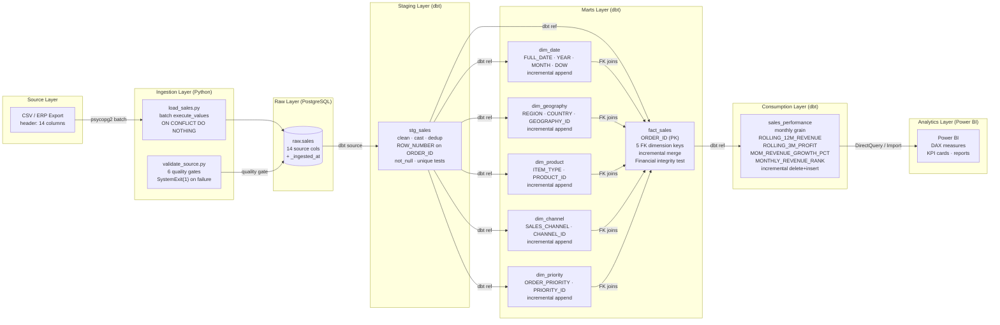
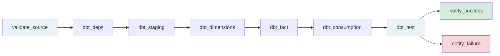

# Data Lineage — Modern Data Platform

This document traces the complete lineage of data from source through to the Power BI
semantic layer, including transformation logic, quality gates, and test coverage at each stage.

---

## Lineage Diagram

---

## Column Lineage: `TOTAL_REVENUE`

| Stage | Table | Column | Transformation |
|---|---|---|---|
| Source | CSV | `Total Revenue` | Raw string from ERP export |
| Raw | `raw.sales` | `TOTAL_REVENUE` | `float(value or 0)` via `_coerce_row` |
| Staging | `stg_sales` | `total_revenue` | Cast to `NUMERIC(14,2)`, null → 0 |
| Fact | `fact_sales` | `TOTAL_REVENUE` | Direct reference, merged on `ORDER_ID` |
| Consumption | `sales_performance` | `MONTHLY_REVENUE` | `SUM(TOTAL_REVENUE)` at month grain |
| Consumption | `sales_performance` | `ROLLING_12M_REVENUE` | `SUM(MONTHLY_REVENUE) OVER (...12 month window)` |
| Analytics | Power BI | `Total Revenue` | `SUM([MONTHLY_REVENUE])` DAX measure |

---

## Column Lineage: `ORDER_DATE`

| Stage | Table | Column | Transformation |
|---|---|---|---|
| Source | CSV | `Order Date` | String, formats: `MM/DD/YYYY`, `YYYY-MM-DD`, `DD/MM/YYYY` |
| Raw | `raw.sales` | `ORDER_DATE` | `_parse_date()` — tries 3 formats, returns `None` if unparseable |
| Staging | `stg_sales` | `order_date` | Cast to `DATE`, not_null test |
| Fact | `fact_sales` | `ORDER_DATE_KEY` | `TO_CHAR(order_date, 'YYYYMMDD')::INT` → FK to `dim_date` |
| Consumption | `sales_performance` | `YEAR`, `MONTH` | Extracted from `dim_date` join |
| Analytics | Power BI | Date hierarchy | Auto-generated from `FULL_DATE` in `dim_date` |

---

## Data Quality Gates by Stage

| Stage | Gate | Tool | Failure action |
|---|---|---|---|
| Pre-ingestion | File exists and is readable | `load_sales.py` | `sys.exit(1)` |
| Post-ingestion | Row count > 0 | `validate_source.py` | Airflow task fails |
| Post-ingestion | NULL ORDER_ID < 1% | `validate_source.py` | Airflow task fails |
| Post-ingestion | No future ORDER_DATE | `validate_source.py` | Airflow task fails |
| Post-ingestion | SHIP_DATE >= ORDER_DATE | `validate_source.py` | Airflow task fails |
| Post-ingestion | UNITS_SOLD all positive | `validate_source.py` | Airflow task fails |
| Staging | `not_null` on order_id | dbt test | Task fails, stored to failures schema |
| Staging | `unique` on order_id | dbt test | Task fails, stored to failures schema |
| Fact | FK relationship (all 5 dims) | dbt test | Task fails |
| Fact | Financial integrity (revenue >= cost + profit) | dbt singular test | Task fails |
| Consumption | Row count sanity | dbt test | Task fails |

---

## Incremental Strategy Reference

| Model | Strategy | Unique key | Notes |
|---|---|---|---|
| `dim_date` | incremental (append) | `FULL_DATE` | Only new dates added; historical dates immutable |
| `dim_geography` | incremental (append) | `GEOGRAPHY_ID` | New region/country combinations added |
| `dim_product` | incremental (append) | `PRODUCT_ID` | New item types added |
| `dim_channel` | incremental (append) | `CHANNEL_ID` | New channels added |
| `dim_priority` | incremental (append) | `PRIORITY_ID` | Static dimension, rarely changes |
| `fact_sales` | incremental (merge) | `ORDER_ID` | Updates existing rows + inserts new |
| `sales_performance` | incremental (delete+insert) | `YEAR, MONTH, ...` | Full month reprocessed on update |

---

## Airflow Task Dependencies

**SLA:** Total pipeline < 20 minutes. Individual task SLAs in [Runbook.md](Runbook.md).
